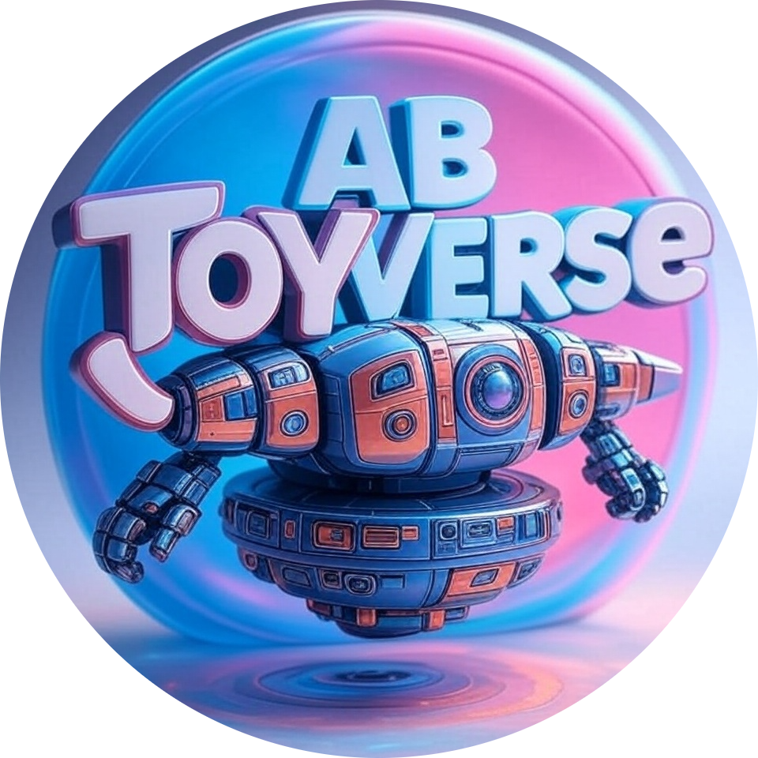
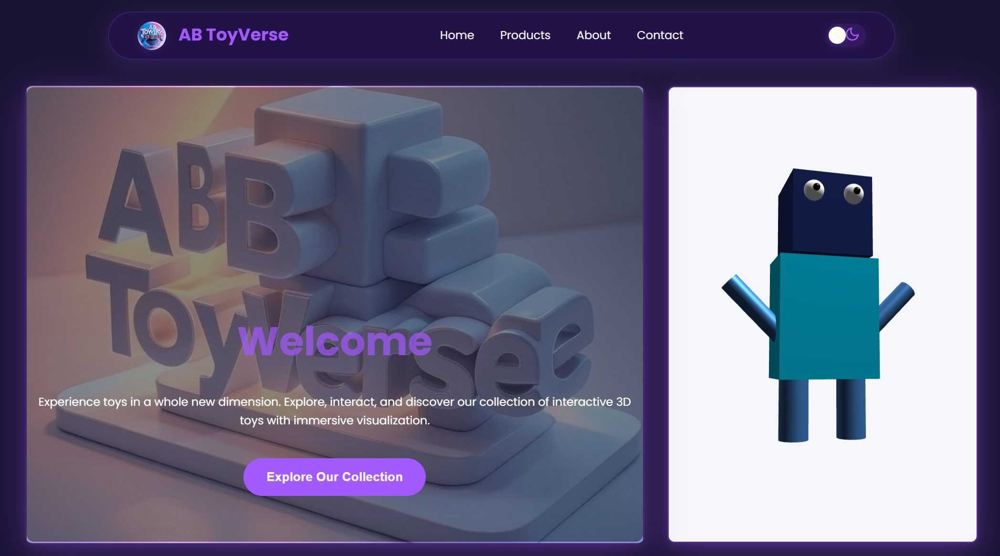
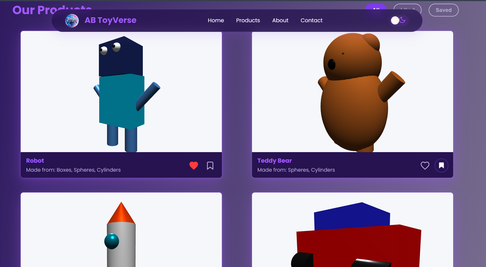
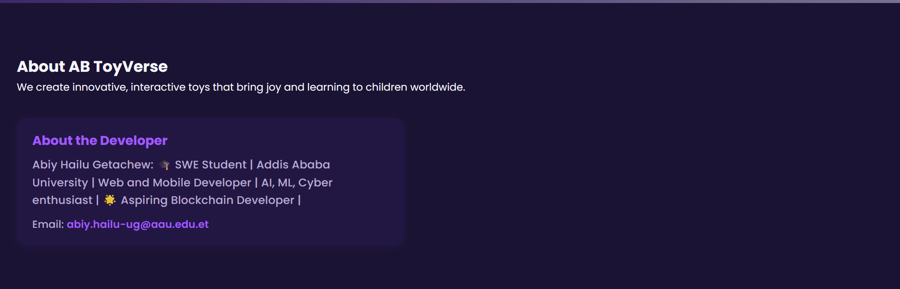
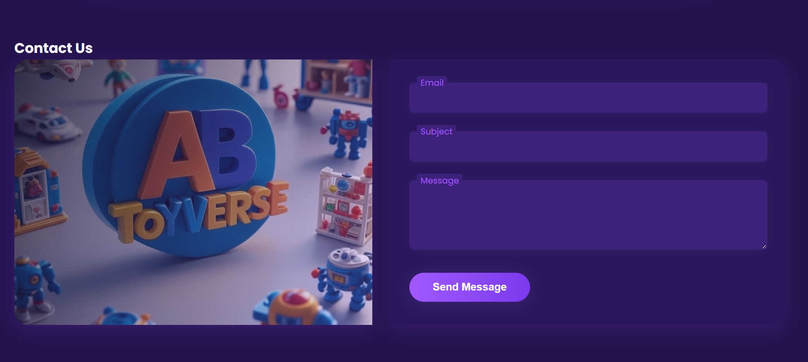
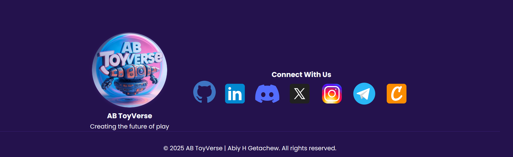

# 🚀 AB ToyVerse - Interactive 3D Product Viewer

<div align="center">



**Individual Assignment: Build an Interactive 3D Product Viewer (Basic Mesh Edition)**

*Experience toys in a whole new dimension with immersive 3D visualization*

[](https://threejs.org/)
[](https://developer.mozilla.org/en-US/docs/Web/JavaScript)
[](https://developer.mozilla.org/en-US/docs/Web/HTML)
[](https://developer.mozilla.org/en-US/docs/Web/CSS)

</div>

---

## 📋 Student Information

| **Field** | **Details** |
|-----------|-------------|
| **Name** | Abiy Hailu |
| **ID** | UGR/8730/15 |
| **Section** | 1 |
| **Assignment** | Individual Assignment: Build an Interactive 3D Product Viewer (Basic Mesh Edition) |

---

## 🎯 Project Overview

AB ToyVerse is an interactive 3D product viewer application built using Three.js that showcases a collection of toys created entirely from basic geometric shapes. The application demonstrates foundational 3D web development concepts including scene setup, mesh composition, lighting, raycasting, animation, and camera controls.

### 🎮 Key Features

- **Interactive 3D Toy Models**: Five unique toys built from basic geometries
- **Real-time Camera Controls**: Orbit, zoom, and pan functionality
- **Mouse Interaction**: Click detection and visual feedback on toy parts
- **Automatic Camera Animation**: Smooth orbital rotation around products
- **Responsive Design**: Works seamlessly across different screen sizes
- **Dark/Light Mode Toggle**: User preference for viewing experience
- **Product Filtering**: Filter toys by likes and bookmarks
- **Modern UI/UX**: Professional, premium-looking interface

---

## 🛠️ Technology Stack

### Frontend Technologies
- **Three.js r128**: 3D graphics library for WebGL rendering
- **JavaScript (ES6+)**: Core programming language
- **HTML5**: Semantic markup structure
- **CSS3**: Advanced styling with animations and responsive design

### Key Libraries & Dependencies
- **OrbitControls**: Camera manipulation and user interaction
- **Google Fonts (Poppins)**: Typography enhancement
- **CDN Resources**: Optimized loading via CDN

### Development Tools
- **Modular Architecture**: Organized code structure with separate modules
- **Responsive Design**: Mobile-first approach
- **Performance Optimization**: Efficient rendering and asset loading

---

## 🎨 Project Structure

```
AB-ToyVerse/
├── 📁 img/
│   ├── homeSBG.jpg          # Hero section background
│   └── logo.png             # Project logo
├── 📁 scripts/
│   ├── main.js              # Main application logic
│   ├── initScene.js         # Scene initialization
│   ├── addLighting.js       # Lighting setup
│   ├── cameraAnimation.js   # Camera movement and controls
│   ├── interaction.js       # Mouse interaction and raycasting
│   ├── createRobot.js       # Robot toy creation
│   ├── teddyBear.js         # Teddy bear toy creation
│   ├── dinoBot.js           # Dinosaur toy creation
│   ├── legoBot.js           # Car toy creation
│   ├── butterfly.js         # Rocket toy creation
│   └── robot.js             # Home screen robot
├── 📁 styles/
│   ├── main.css             # Main stylesheet
│   └── 📁 svg/              # Social media icons
├── index.html               # Main HTML file
└── README.md                # Project documentation
```

---

## 🎪 Featured Products

### 1. 🤖 Robot
- **Materials**: Boxes, Spheres, Cylinders
- **Features**: Interactive parts, metallic appearance
- **Interaction**: Click on different body parts for feedback

### 2. 🧸 Teddy Bear
- **Materials**: Spheres, Cylinders
- **Features**: Soft, plush-like appearance
- **Interaction**: Gentle animations and color changes

### 3. 🚀 Rocket
- **Materials**: Cones, Cylinders, Spheres
- **Features**: Space-themed design with metallic finish
- **Interaction**: Engine glow effects and part highlighting

### 4. 🚗 Car
- **Materials**: Boxes, Cylinders
- **Features**: Sleek automotive design
- **Interaction**: Wheel rotation and body part selection

### 5. 🦖 Dino Bot
- **Materials**: Boxes, Cylinders, Spheres
- **Features**: Prehistoric robot hybrid design
- **Interaction**: Eye animations and body part responses

---

## 🖼️ Screenshots

<div align="center">

### Application Screenshots

<div style="display: grid; grid-template-columns: 1fr 1fr; gap: 20px; margin-bottom: 20px;">


*Home page with hero section and 3D robot*


*Products section with interactive 3D toys*

</div>

<div style="display: grid; grid-template-columns: 1fr 1fr; gap: 20px; margin-bottom: 20px;">


*Robot toy with interactive parts and lighting*


*Teddy bear with soft materials and animations*

</div>

<div style="display: grid; grid-template-columns: 1fr; gap: 20px;">


*Application in dark mode with enhanced UI*

</div>

</div>

---

## 🚀 Getting Started

### Prerequisites
- Modern web browser with WebGL support
- Local web server (for development)

### Installation & Setup

1. **Clone the Repository**
   ```bash
   git clone <repository-url>
   cd AB-ToyVerse
   ```

2. **Start Local Server**
   ```bash
   # Using Python 3
   python -m http.server 8000
   
   # Using Node.js
   npx serve .
   
   # Using PHP
   php -S localhost:8000
   ```

3. **Open in Browser**
   ```
   http://localhost:8000
   ```

### Usage Instructions

1. **Navigation**: Use the navigation bar to move between sections
2. **3D Interaction**: 
   - **Mouse**: Click and drag to rotate, scroll to zoom
   - **Touch**: Swipe to rotate, pinch to zoom
3. **Product Interaction**: Click on different parts of toys for visual feedback
4. **Theme Toggle**: Use the dark/light mode button in the navigation
5. **Product Filtering**: Use filter buttons to view liked or saved products

---

## 🎯 Technical Implementation

### Scene Setup
- **PerspectiveCamera**: Configured for optimal viewing angles
- **WebGLRenderer**: High-performance 3D rendering
- **Responsive Canvas**: Adapts to window resizing

### Lighting System
- **Ambient Light**: Base illumination for overall visibility
- **Directional Light**: Creates highlights and shadows
- **Dynamic Positioning**: Optimized for each toy model

### Interaction System
- **Raycasting**: Precise mouse click detection
- **Visual Feedback**: Color changes and scaling effects
- **Part Identification**: Displays component names on interaction

### Animation System
- **Automatic Rotation**: Smooth camera orbital movement
- **User Override**: Manual controls pause auto-rotation
- **Performance Optimized**: Efficient animation loops

---

## 🎨 Design Features

### User Interface
- **Modern Design**: Clean, professional aesthetic
- **Responsive Layout**: Adapts to all screen sizes
- **Smooth Animations**: CSS transitions and transforms
- **Accessibility**: ARIA labels and keyboard navigation

### Visual Effects
- **Material Realism**: MeshStandardMaterial for realistic lighting
- **Dynamic Shadows**: Real-time shadow casting
- **Color Schemes**: Coordinated light and dark themes
- **Typography**: Google Fonts integration for readability

---

## 🔧 Customization

### Adding New Toys
1. Create a new JavaScript file in the `scripts/` directory
2. Follow the existing toy creation pattern
3. Add the toy to the HTML structure
4. Update the main.js file to include the new toy

### Modifying Materials
- Edit material properties in individual toy files
- Adjust lighting parameters in `addLighting.js`
- Modify camera settings in `cameraAnimation.js`

### Styling Changes
- Update `styles/main.css` for visual modifications
- Modify color schemes and animations
- Adjust responsive breakpoints

---

## 🐛 Troubleshooting

### Common Issues

**3D Objects Not Visible**
- Check WebGL support in browser
- Verify Three.js library loading
- Ensure proper camera positioning

**Performance Issues**
- Reduce polygon count in complex models
- Optimize lighting setup
- Check for memory leaks in animation loops

**Interaction Problems**
- Verify raycasting implementation
- Check event listener setup
- Ensure proper object positioning

---

## 📚 Learning Outcomes

This project demonstrates mastery of:

- **Three.js Fundamentals**: Scene, camera, renderer setup
- **3D Geometry**: Creating complex shapes from basic primitives
- **Material Systems**: Realistic lighting and material properties
- **User Interaction**: Mouse controls and raycasting
- **Animation**: Camera movement and object animations
- **Web Development**: Modern HTML, CSS, and JavaScript practices
- **Responsive Design**: Cross-device compatibility
- **Code Organization**: Modular architecture and maintainability

---

## 🤝 Contributing

This is an individual assignment project. For educational purposes, feel free to:
- Study the code structure
- Experiment with modifications
- Learn from the implementation patterns

---

## 📄 License

This project is created for educational purposes as part of the Interactive 3D Product Viewer assignment.

---

## 👨‍💻 Author

**Abiy Hailu**  
*Student ID: UGR/8730/15*  
*Section: 1*

---

<div align="center">

**Built with ❤️ using Three.js**

*Experience the future of interactive 3D product visualization*

</div> 
